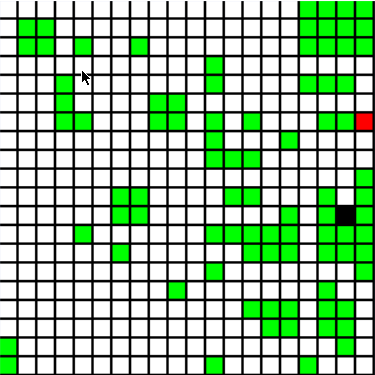
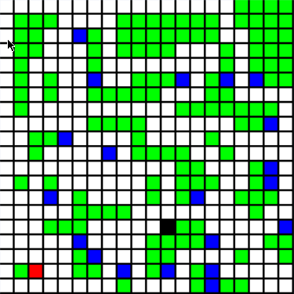
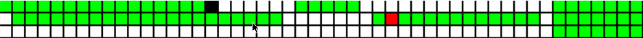
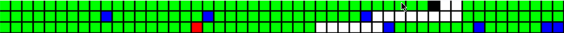

# Snake Player - Cameron Custer #
Well-written implementation in C++ of generic snake player for the classic "Snake
Game." Player is dictated only by SSSP graph traversal algorithms. The player was
developed through a series of trail and error. Initally I intended to develop a
Genetic Algorithm for the game of Snake, but this was unsuccessful as you can
read from my log. I also attempted using DFS and BFS (SSSP) algorithms for
pathfinding, but AStar yeilded the best performance and allowed me to integrate
my own heuristic function. While the integration of the heuristic was
unsuccessful, the pathfinding algorithm has performed better than expected.
Behaviors evolved from the player which had not been accounted for in the code.
For example, upon watching the snake graphically I noticed if the food is
surrounded by the snakes tail the snake will position more space between the
food of the snake and the snakes tail to allow the snake to eat the food.
Overall the algorithm gave outstanding performance, frequency acheiving a perfect
score, and nearing a perfect score almost every run. The player also handles non-
traditional size grids well (with or without obstacles).

## Steps in the Pathfinding Algorithm ##
1. Locate a path to the food.
2. Simulate the path to the food.
3. Locate a path to the tail on the simulated game.
4. If either the path to the food or the path to the tail does not exist then
    follow the tail.
### Pseudocode for the Pathfinding Algorithm ###
```
find path to follow tail

if path to apple exists:
    execute path to the apple

    if path back to the tail exists:
        return path to apple + path back to tail

    else
        return path to follow tail

else
    return path to follow tail
```

### Development Process ###
[CHANGELOG](Log)

## Performance ##
**Performance 20x20**
- Number Items : 100
- Average Score: 351.78
- Maximum Score: 396
- Average Time : 8.6326409e-05

**Performance 20x20 Obstacles**
- Number Items : 100
- Average Score: 297.29
- Maximum Score: 357
- Average Time : 8.6697314e-05

**View more specs about the [PERFORMANCE](PERFORMANCE.md)**

### Action Shots ###

&nbsp; &nbsp; &nbsp; &nbsp; &nbsp; &nbsp; &nbsp; &nbsp; &nbsp; &nbsp;

&nbsp; &nbsp; &nbsp; &nbsp; &nbsp; &nbsp; &nbsp; &nbsp; &nbsp; &nbsp;

&nbsp; &nbsp; &nbsp; &nbsp; &nbsp; &nbsp; &nbsp; &nbsp; &nbsp; &nbsp;


## Conclusion ##
This project was one of my favorites as it required genuine thought, this
was not some algorithm that could just be found online "unless you wanted
to try to implemented a nerual net or some sort of evolutionary algorithm."
Leveraging graph traversals this way was a fantastic learning experience,
I did not think it was possible. I spent majority of my time thinking about
the solution at the beginning of the project. It took a while before I
finally arrived at the solution -
key observations: follow the tail, don't get trapped
I should hope this project is continued for many years to come as it was
some of the most excitment I have had while writing code (I get pretty
excited to write code so don't take that lightly)
