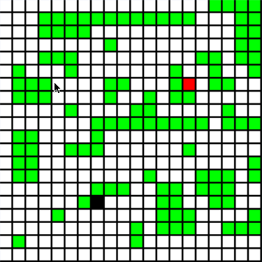

# Snake Player - Cameron Custer #
Well-written implementation in C++ of generic snake player for the classic "Snake
Game." Player is dictated only by SSSP graph traversal algorithms. The player was
developed through a series of trail and error. Initally I intended to develop a
Genetic Algorithm for the game of Snake, but this was unsuccessful as you can
read from my log. I also attempted using DFS and BFS (SSSP) algorithms for
pathfinding, but AStar yeilded the best performance and allowed me to integrate
my own heuristic function. While the integration of the heuristic was
unsuccessful, the pathfinding algorithm has performed better than expected.
Behaviors evolved from the player which had not been accounted for in the code.
For example, upon watching the snake graphically I noticed if the food is
surrounded by the snakes tail the snake will position more space between the
food of the snake and the snakes tail to allow the snake to eat the food.
Overall the algorithm gave outstanding performance, frequency acheiving a perfect
score, and nearing a perfect score almost every run. The player also handles non-
traditional size grids well (with or without obstacles).

## Algorithm Performace ##
**Performance 100 Trials 03x50**
- Average Score: 35.9937888198758
- Maximum Score: 133
- Average Time : 0.000116288707453416

**Performance 100 Trials 03x40**
- Average Score: 31.2298136645963
- Maximum Score: 111
- Average Time : 9.10066559006211e-05

**Performance 100 Trials 05x05**
- Average Score: 19.9873417721519
- Maximum Score: 24
- Average Time : 1.2953195e-05

**Performance 100 Trials 10x10**
- Average Score: 87.75625
- Maximum Score: 100
- Average Time : 2.42846275e-05

**Performance 100 Trials 10x20**
- Average Score: 163.4
- Maximum Score: 198
- Average Time : 6.728642125e-05

**Performance 100 Trials 10x30**
- Average Score: 229.9125
- Maximum Score: 297
- Average Time : 0.000114892101875

**Performance 100 Trials 20x20**
- Average Score: 351.822784810127
- Maximum Score: 396
- Average Time : 8.95965981012658e-05

**Performance 100 Trials 20x30**
- Average Score: 507.284810126582
- Maximum Score: 587
- Average Time : 0.000167905132911392

**Performance 100 Trials 30x30**
- Average Score: 775.891719745223
- Maximum Score: 886
- Average Time : 0.000236785101910828

Steps in the Pathfinding Algorithm
---
1. Locate a path to the food.
2. Simulate the path to the food.
3. Locate a path to the tail on the simulated game.
4. If either the path to the food or the path to the tail does not exist then
    follow the tail.
---

### Algorithm Development ###
[CHANGELOG](Log)

### Action Shots ###

