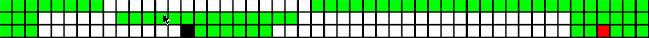

# Snake Player #
Well-written implementation in C++ of generic snake player for the classic "Snake
Game." Player is dictated only by SSSP graph traversal algorithms. The player was
developed through a series of trail and error. Initially I intended to develop a
Genetic Algorithm for the game of Snake, but this was unsuccessful as you can
read from my log. I also attempted using DFS and BFS (SSSP) algorithms for
pathfinding, but AStar yielded the best performance and allowed me to integrate
my own heuristic function. While the integration of the heuristic was
unsuccessful, the pathfinding algorithm has performed better than expected.
Behaviors evolved from the player which had not been accounted for in the code.
For example, upon watching the snake graphically I noticed if the food is
surrounded by the snakes tail the snake will position more space between the
food of the snake and the snakes tail to allow the snake to eat the food.
Overall the algorithm gave outstanding performance, frequency achieving a perfect
score, and nearing a perfect score almost every run. The player also handles non-
traditional size grids well (with or without obstacles).

## Steps in the Pathfinding Algorithm ##
1. Locate a path to the food.
2. Simulate the path to the food.
3. Locate a path to the tail on the simulated game.
4. If either the path to the food or the path to the tail does not exist then
    follow the tail.
### Pseudocode for the Pathfinding Algorithm ###
```
find path to follow tail

if path to apple exists:
    execute path to the apple

    if path back to the tail exists:
        return path to apple + path back to tail
    else
        return path to follow tail
else
    return path to follow tail
```

**View more specs about the development [CHANGELOG](CHANGELOG.md)**

## Performance ##
#### Plot ####


#### Sample Data ####
**Performance 20x20**
- Number Items : 100
- Minimum Score: 1
- Average Score: 339.94
- Maximum Score: 400
- Average Time : 0.000112074759

**Performance 20x20 Obstacles**
- Number Items : 100
- Minimum Score: 1
- Average Score: 287.44
- Maximum Score: 362
- Average Time : 0.000108581484

**View more specs about the [PERFORMANCE](PERFORMANCE.md)**

### Action Shots ###

&nbsp; &nbsp; &nbsp; &nbsp; &nbsp; &nbsp; &nbsp; &nbsp; &nbsp; &nbsp;

&nbsp; &nbsp; &nbsp; &nbsp; &nbsp; &nbsp; &nbsp; &nbsp; &nbsp; &nbsp;

&nbsp; &nbsp; &nbsp; &nbsp; &nbsp; &nbsp; &nbsp; &nbsp; &nbsp; &nbsp;


## Review ##
This project was one of my favorites as it required genuine thought, this
was not some algorithm that could just be found online "unless you wanted
to try to implement a neural net or some sort of evolutionary algorithm."
Leveraging graph traversals this way was a fantastic learning experience,
I did not think it was possible. I spent majority of my time thinking about
the solution at the beginning of the project. It took a while before I
finally arrived at the solution -
key observations: follow the tail, don't get trapped
I should hope this project is continued for many years to come as it was
some of the most excitement I have had while writing code (I get pretty
excited to write code so don't take that lightly)

## Improvements ##
I theorized a perfect game was always possible without obstacles because the
snake can always restructure it's body given enough moves to eat the food assuming
at least one square is available. The theory is challenging to implement and to
my understanding could only be done with a neural network which perfectly
approximated the board in it's calculations; otherwise, S-Road is always an
effective approach if time is not a factor.

The 'perfect game' theory does not hold for boards with obstacles because the
location of the food relative to the obstacles can result in an impossible game.
If the game protected against impossible games, the 'perfect game' theory would
be proven, but implementation of such an algorithm is beyond my scope of
knowledge.

My current player performs well enough to satisfy my goals for the purpose of
this project, and anyone seeking to continue the project should begin by
consulting my idea's above.
